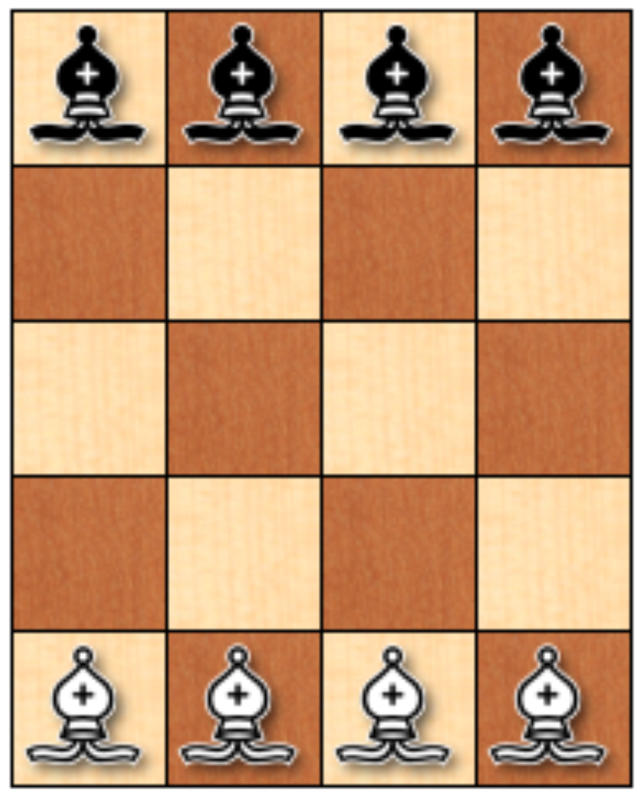

# Practica 3 Introducción a la Inteligencia Artificial Introspección

### Indicaciones

* Escribir un ensayo de minimo 3 cuartillas acerca de como resolverias el siguiente problema:

Coloca ocho alfiles (cuatro negros y cuatro blancos) en un tablero de ajedrez reducido, tal como se ve en la figura.

El problema consiste en hacer que los alfiles negros intercambien sus posiciones con los blancos, ningún alfil debe atacar en ningún momento otro del color opuesto. Se deben alternar los movimientos, primero uno blanco, luego uno negro, luego uno blanco y así sucesivamente. ¿Cuál es el mínimo número de movimientos en que se puede conseguir?

## Introduccion

El ajedrez considerado como un juego de estrategia, no solo requiere ingenio tactico sino tambien de una profunda compresion de la disposicion y movimiento de sus piezas. La disposicion inicial de los alfiles en el tablero genera un desafio interesante. Como bien sabemos el ajedrez convencional cuenta con 8 piezas o posiciones de largo mientras que en este contexto es de 4, es decir la mitad de las posiciones. Por lo que este escenario, aparentemente simple, encierra una danza estratégica que exploraremos a través de este ensayo.

## Desarrollo

En el vasto universo del ajedrez, cada disposición inicial de piezas engendra posibilidades tácticas únicas, y ninguna otra configuración despierta tanto interés estratégico como el desafío de intercambiar las posiciones de los alfiles negros y blancos sin permitir que se amenacen entre sí. Este escenario plantea un juego sutil que va más allá de la simple captura de piezas

Como primer punto representaremos los blancos con "B" y los negros con "N".
Sin hacer cambios nuestro tablero se ve asi:

| N | N | N | N |
|---|---|---|---|
| . | . | . | . |
| . | . | . | . |
| . | . | . | . |
| B | B | B | B |

En este primer movimiento el alfil blanco de la segunda columna y ultimo renglon se mueve en diagonal hacia arriba, quedando en la tercer columna y penultimo renglon lo cual queda representado de la siguiente forma:

| N | N | N | N |
|---|---|---|---|
| . | . | . | . |
| . | . | . | . |
| . | . | B | . |
| B | . | B | B | 1

Ahora es turno de los alfiles negros, siendo su movimiento pasar de la tercera columna y primer renglon al segundo renglon de la segunda columna 

| N | N | . | N |
|---|---|---|---|
| . | N | . | . |
| . | . | . | . |
| . | . | B | . |
| B | . | B | B | 1

Continuando con los blancos, el de la primera columna y ultimo renglon pasara diagonalente hacia arriba quedando su destino como ultima columna y segundo renglon

| N | N | . | N |
|---|---|---|---|
| . | N | . | B |
| . | . | . | . |
| . | . | B | . |
| . | . | B | B | 2

El siguiente turno de los alfiles negros sera pasar de la ultima columna y primer renglon hacia la primera columna y penultimo renglon

| N | N | . | . |
|---|---|---|---|
| . | N | . | B |
| . | . | . | . |
| N | . | B | . |
| . | . | B | B | 2

El alfil blanco que se encuentra en la penultima columna y ultimo renglon pasa a estar en la segunda columna y penultimo renglon 

| N | N | . | . |
|---|---|---|---|
| . | N | . | B |
| . | . | . | . |
| N | B | B | . |
| . | . | . | B | 3 

El alfil negro que se encontraba en la segunda columna y primer renglon pasa a estar en la tercera columna y segundo renglon

| N | . | . | . |
|---|---|---|---|
| . | N | N | B |
| . | . | . | . |
| N | B | B | . |
| . | . | . | B | 3

El alfil blanco que se encontraba en la tercera columna y cuarto renglon pasa a estar en la primera columna y segundo renglon 

| N | . | . | . |
|---|---|---|---|
| B | N | N | B |
| . | . | . | . |
| N | B | . | . |
| . | . | . | B | 4 

El alfil negro que se encuentra en la segunda columna y segundo renglon pasa a la ultima columna y penultimo renglon 

| N | . | . | . |
|---|---|---|---|
| B | . | N | B |
| . | . | . | . |
| N | B | . | N |
| . | . | . | B | 4

El alfil blanco que se encuentra en la ultima columna y segundo renglon pasa a la penultima columna y primer renglon

| N | . | B | . |
|---|---|---|---|
| B | . | N | . |
| . | . | . | . |
| N | B | . | N |
| . | . | . | B | 5

El alfil negro que se encuentra en la primera columna y penultimo renglon pasa a la segunda columna y ultimo renglon

| N | . | B | . |
|---|---|---|---|
| B | . | N | . |
| . | . | . | . |
| . | B | . | N |
| . | N | . | B | 5

El alfil blanco que se encuentra en la segunda columna y penultimo renglon pasa a la primera columna y tercer renglon

| N | . | B | . |
|---|---|---|---|
| B | . | N | . |
| B | . | . | . |
| . | . | . | N |
| . | N | . | B | 6

El alfil negro que se encuentra en la tercera columna y segundo renglon pasa a la ultima columna y tercer renglon

| N | . | B | . |
|---|---|---|---|
| B | . | . | . |
| B | . | . | N |
| . | . | . | N |
| . | N | . | B | 6

El alfil blanco que se encuentra en la primera columna y segundo renglon pasa a la segunda columna y tercer renglon

| N | . | B | . |
|---|---|---|---|
| . | . | . | . |
| B | B | . | N |
| . | . | . | N |
| . | N | . | B | 7

El alfil negro que se encuentra en ultima columna y penultimo renglon pasa a la tercera columna y tercer renglon

| N | . | B | . |
|---|---|---|---|
| . | . | . | . |
| B | B | N | N |
| . | . | . | . |
| . | N | . | B | 7

El alfil blanco que se encuentra en la primer columna y tercer renglon pasa a la penultima columna y ultimo renglon

| N | . | B | . |
|---|---|---|---|
| . | . | . | . |
| . | B | N | N |
| . | . | . | . |
| . | N | B | B | 8

El alfil negro que se encuentra en la ultima columna y tercer renglon pasa pasa a la segunda columna y primer renglon 

| N | N | B | . |
|---|---|---|---|
| . | . | . | . |
| . | B | N | . |
| . | . | . | . |
| . | N | B | B | 8

El alfil blanco que se encuentra en la segunda columna y tercer renglon pasa a la ultima columna y primer renglon 

| N | N | B | B |
|---|---|---|---|
| . | . | . | . |
| . | . | N | . |
| . | . | . | . |
| . | N | B | B | 9

El alfil negro que se encuentra en la tercera columna y tercer renglon pasa a la tercera columna y segundo renglon 

| N | N | B | B |
|---|---|---|---|
| . | . | N | . |
| . | . | . | . |
| . | . | . | . |
| . | N | B | B | 9E

El alfil blanco que se encuentra en la ultima columna y ultimo renglon pasa a la segunda columna y tercer renglon

| N | N | B | B |
|---|---|---|---|
| . | . | N | . |
| . | B | . | . |
| . | . | . | . |
| . | N | B | . | 10

El alfil negro que se encuentra en la primera columna y primer renglon pasa a la tercera columna y tercer renglon

| . | N | B | B |
|---|---|---|---|
| . | . | N | . |
| . | B | N | . |
| . | . | . | . |
| . | N | B | . | 10

El alfil blanco que se encuentra en la tercera columna y primer renglon pasa a la primera columna y tercer renglon

| . | N | . | B |
|---|---|---|---|
| . | . | N | . |
| B | B | N | . |
| . | . | . | . |
| . | N | B | . | 11

El alfin negro que se encuentra en la segunda columna y ultimo renglon pasa a la ultima columna y tercer renglon 

| . | N | . | B |
|---|---|---|---|
| . | . | N | . |
| B | B | N | N |
| . | . | . | . |
| . | . | B | . | 11

El alfil blanco que se encuentra en la segunda columna y tercer renglon pasa a la primera columna y cuarto renglon 

| . | N | . | B |
|---|---|---|---|
| . | . | N | . |
| B | . | N | N |
| B | . | . | . |
| . | . | B | . | 12

El alfil negro que se encuentra en la tercera columna y tercer renglon pasa a la ultima columna y segundo renglon 

| . | N | . | B |
|---|---|---|---|
| . | . | N | N |
| B | . | . | N |
| B | . | . | . |
| . | . | B | . | 12

El alfil blanco que se encuentra en la penultima columna y ultimo renglon pasa a la ultima columna y penultimo renglon 

| . | N | . | B |
|---|---|---|---|
| . | . | N | N |
| B | . | . | N |
| B | . | . | B |
| . | . | . | . | 13

El alfil negro que se encuentra en la segunda columnax y primer renglon pasa a la primera columna y segundo renglon 

| . | . | . | B |
|---|---|---|---|
| N | . | N | N |
| B | . | . | N |
| B | . | . | B |
| . | . | . | . | 13

El alfil blanco que se encuentra en la ultima columna y penultimo renglon pasa a la primera columna y primer renglon

| B | . | . | B |
|---|---|---|---|
| N | . | N | N |
| B | . | . | N |
| B | . | . | . |
| . | . | . | . | 14

En alfil negro que se encuentra en la primera columna y segundo renglon pasa a la ultima columna y ultimo renglon 

| B | . | . | B |
|---|---|---|---|
| . | . | N | N |
| B | . | . | N |
| B | . | . | . |
| . | . | . | N | 14

El alfil blanco que se encuentra en la primera columna y tercer renglon pasa a la segunda columna y segundo renglon 

| B | . | . | B |
|---|---|---|---|
| . | B | N | N |
| . | . | . | N |
| B | . | . | . |
| . | . | . | N | 15

El alfiln negro que se encuentra en la ultima columna y tercer renglon pasa a la penultima columna y cuarto renglon 

| B | . | . | B |
|---|---|---|---|
| . | B | N | N |
| . | . | . | . |
| B | . | N | . |
| . | . | . | N | 15

El alfil blanco que se encuentra en la primera columna y penultimo renglo pasa a la tercera columna y segundo renglon

| B | . | . | B |
|---|---|---|---|
| . | B | B | N |
| . | . | . | . |
| N | . | N | . |
| . | . | . | N | 16E

El alfil negro que se encuentra en la ultima columna y segundo renglon pasa a la segunda columna y cuarto renglon 

| B | . | . | B |
|---|---|---|---|
| . | B | B | . |
| . | . | . | . |
| N | N | N | . |
| . | . | . | N | 16

El alfil blanco que se encuentra en la segunda columna y segundo renglon pasa a la tercera columna y primer renglon

| B | . | B | B |
|---|---|---|---|
| . | . | B | . |
| . | . | . | . |
| N | N | N | . |
| . | . | . | N | 17

El alfil negro que se encuentra en la penultima columna y penultimo renglon pasa a la segunda columna y ultimo renglon

| B | . | B | B |
|---|---|---|---|
| . | . | B | . |
| . | . | . | . |
| N | N | . | . |
| . | N | . | N | 17

El alfil blanco que se encuentra en la tercera columna y segundo renglon pasa a la segunda columna y primer renglon

| B | B | B | B |
|---|---|---|---|
| . | . | . | . |
| . | . | . | . |
| N | N | . | . |
| . | N | . | N | 18

El alfil negro que se encuentra en la segunda columna y cuarto renglon o penultimo renglon pasa a la tercera columna y ultimo renglon

| B | B | B | B |
|---|---|---|---|
| . | . | . | . |
| . | . | . | . |
| N | . | . | . |
| . | N | N | N | 18

## Conclusion

Como podemos ver nos queda un pieza que no llego satisfactoriamente a su posicion, ya que como recordamos los alfiles en el ajedrez solo avanzan en forma de diagonal por lo que se necesitaria de mas espacios en el tablero para suponer que si se puede cumplir, en este caso yo no pude y asi fue como lo haria.

El ajedrez, con sus movimientos precisos y estrategias refinadas, es un campo donde convergen la ciencia y el arte. La disposición final de los alfiles, resultado de una coreografía estratégica, es un testimonio de la riqueza que este juego aporta a aquellos que se sumergen en su complejidad. Cada partida es una sinfonía única, y este intercambio de alfiles destaca la capacidad del ajedrez para cautivar y desafiar a jugadores y espectadores por igual. En última instancia, el tablero de ajedrez se convierte en un lienzo donde se pintan historias tácticas, y los alfiles, en sus movimientos aparentemente simples, contribuyen a la grandiosa narrativa de este juego atemporal.