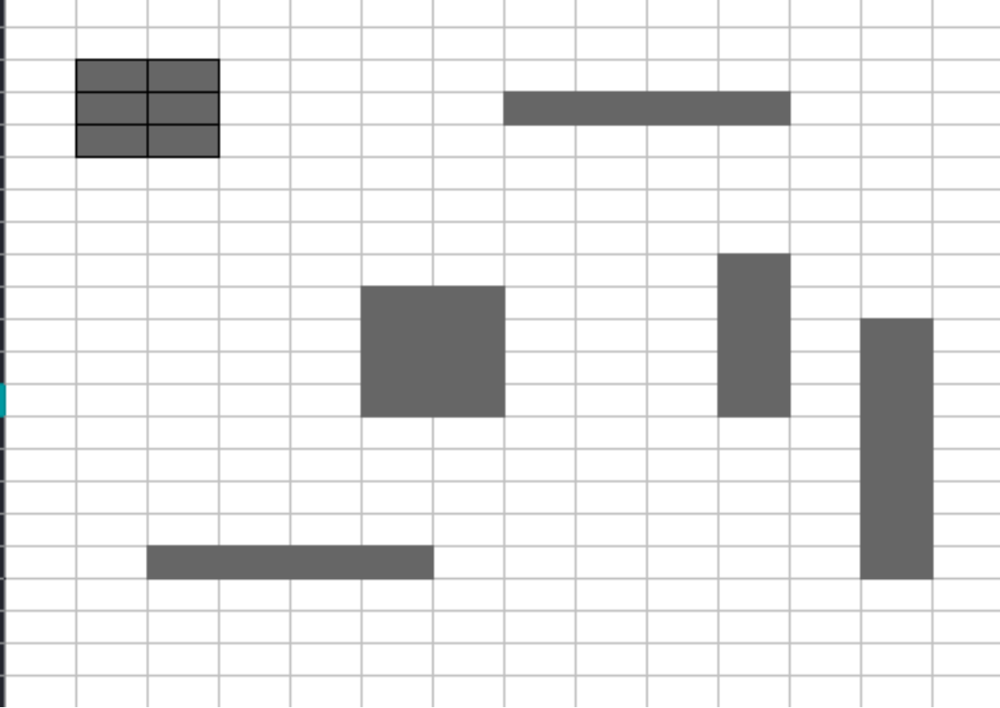

# Practica 4 Introducción a la Inteligencia Artificial Introspección

### Indicaciones

* Se requiere resolver el siguiente problema analizado, la forma en que uste mismo resuelve el problema redactar un ensayo de la solución mínimo 3 cuartillas. 
* Se trata de contar el numero de elementos (islas) contenidos en la siguiente imagen, se requiere lo siguiente:




* Hacer un programa que pueda contar el numero de elementos que son del mismo color

* Utilizar método iterativo y recursivo

## Introducción

Las matrices bidimensionales brindan una representación estructurada de datos en forma de cuadrícula, lo que con frecuencia presenta desafíos algorítmicos interesantes. Uno de estos retos comunes es la identificación y conteo de "islas" en la matriz, donde una isla consta de elementos conectados del mismo color. Este problema es fundamental en áreas como la visión por computadora, los videojuegos y los algoritmos gráficos.

Este ensayo se centra en la implementación de un programa en Java para contar el número de islas en una matriz. Presentaremos dos enfoques principales: uno iterativo y otro recursivo. Estos métodos proporcionan diferentes perspectivas sobre cómo abordar el problema, cada uno con sus propias ventajas y consideraciones.

El método iterativo del programa aplica un enfoque basado en bucles para explorar la matriz y contar las islas. Por otro lado, el método recursivo utiliza llamadas a funciones dentro de funciones para lograr el mismo resultado. Exploraremos ambos enfoques, analizando sus características, efectividad y posibles usos.

A través de este análisis, destacaremos la importancia de elegir el mejor método de acuerdo al contexto y los objetivos del problema. Además, examinaremos cómo estas implementaciones abordan retos específicos relacionados con la identificación y marcado de islas, y cómo administran eficientemente la exploración de la matriz.

En última instancia, este artículo busca proporcionar una comprensión más profunda de las estrategias utilizadas para contar islas en una tabla, ofreciendo una visión detallada de las soluciones iterativas y recursivas.

## Desarrollo

Las matrices bidimensionales son estructuras de datos fundamentales que encuentran aplicación en diversos campos, y uno de los problemas comunes asociados con ellas es la identificación y contabilización de "islas". Una isla en este contexto se define como un conjunto de elementos adyacentes del mismo color. Este problema tiene aplicaciones prácticas en áreas como la visión por computadora y los algoritmos de análisis de imágenes, así como en la optimización de juegos y gráficos.

### Implementación del Programa en Java:
#### Enfoque Iterativo:

El enfoque iterativo para contar islas en una matriz implica el uso de bucles para explorar la matriz y un algoritmo que marca las islas a medida que se encuentran. A continuación, se presenta un ejemplo de código en Java que ilustra este enfoque:

```
public class ContadorIslasIterativo {
    public int contarIslas(char[][] matriz) {
        if (matriz == null || matriz.length == 0 || matriz[0].length == 0) {
            return 0;
        }

        int filas = matriz.length;
        int columnas = matriz[0].length;
        int contadorIslas = 0;

        for (int i = 0; i < filas; i++) {
            for (int j = 0; j < columnas; j++) {
                if (matriz[i][j] == '1') {
                    contadorIslas++;
                    marcarIslaComoVisitada(matriz, i, j);
                }
            }
        }

        return contadorIslas;
    }

    private void marcarIslaComoVisitada(char[][] matriz, int i, int j) {
        int filas = matriz.length;
        int columnas = matriz[0].length;

        if (i < 0 || i >= filas || j < 0 || j >= columnas || matriz[i][j] == '0') {
            return;
        }

        matriz[i][j] = '0'; // Marcar como visitado

        // Explorar en todas las direcciones
        marcarIslaComoVisitada(matriz, i + 1, j);
        marcarIslaComoVisitada(matriz, i - 1, j);
        marcarIslaComoVisitada(matriz, i, j + 1);
        marcarIslaComoVisitada(matriz, i, j - 1);
    }

    public static void main(String[] args) {
        char[][] matriz = {
                {'1', '1', '0', '0', '0'},
                {'1', '1', '0', '0', '1'},
                {'0', '0', '0', '1', '1'},
                {'0', '0', '0', '1', '0'}
        };

        ContadorIslasIterativo contador = new ContadorIslasIterativo();
        int numeroIslas = contador.contarIslas(matriz);

        System.out.println("Número de islas: " + numeroIslas);
    }
}

```

Este programa utiliza un enfoque basado en bucles para recorrer la matriz y cuenta las islas utilizando un método auxiliar para marcar las celdas visitadas.

#### Enfoque Recursivo:

El enfoque recursivo para contar islas en una matriz también marca las celdas a medida que se encuentran, pero utiliza llamadas recursivas en lugar de bucles. Aquí hay un ejemplo de código en Java:

```
public class ContadorIslasRecursivo {
    public int contarIslas(char[][] matriz) {
        if (matriz == null || matriz.length == 0 || matriz[0].length == 0) {
            return 0;
        }

        int filas = matriz.length;
        int columnas = matriz[0].length;
        int contadorIslas = 0;

        for (int i = 0; i < filas; i++) {
            for (int j = 0; j < columnas; j++) {
                if (matriz[i][j] == '1') {
                    contadorIslas++;
                    explorarYMarcarIsla(matriz, i, j);
                }
            }
        }

        return contadorIslas;
    }

    private void explorarYMarcarIsla(char[][] matriz, int i, int j) {
        int filas = matriz.length;
        int columnas = matriz[0].length;

        if (i < 0 || i >= filas || j < 0 || j >= columnas || matriz[i][j] == '0') {
            return;
        }

        matriz[i][j] = '0'; // Marcar como visitado

        // Explorar en todas las direcciones
        explorarYMarcarIsla(matriz, i + 1, j);
        explorarYMarcarIsla(matriz, i - 1, j);
        explorarYMarcarIsla(matriz, i, j + 1);
        explorarYMarcarIsla(matriz, i, j - 1);
    }

    public static void main(String[] args) {
        char[][] matriz = {
                {'1', '1', '0', '0', '0'},
                {'1', '1', '0', '0', '1'},
                {'0', '0', '0', '1', '1'},
                {'0', '0', '0', '1', '0'}
        };

        ContadorIslasRecursivo contador = new ContadorIslasRecursivo();
        int numeroIslas = contador.contarIslas(matriz);

        System.out.println("Número de islas: " + numeroIslas);
    }
}

```

Este programa utiliza llamadas recursivas para explorar y contar las islas en la matriz. Cada celda visitada se marca para evitar el procesamiento redundante.

### Conclusion

En este análisis, hemos explorado dos enfoques para abordar el desafío de contar islas en una matriz bidimensional utilizando Java: un método iterativo y otro recursivo. Ambos métodos ofrecen soluciones efectivas para el problema, cada uno con sus propias características y consideraciones.

El enfoque iterativo se destaca por su estructura basada en bucles, que facilita la comprensión y el seguimiento del flujo del programa. La implementación utiliza un enfoque sistemático para explorar la matriz y cuenta las islas al marcar las celdas visitadas. Este enfoque puede ser preferido en situaciones donde la claridad y la simplicidad del código son prioritarias.

Por otro lado, el enfoque recursivo utiliza llamadas a funciones recursivas para lograr el mismo objetivo. Aunque puede resultar más conciso en términos de código, puede requerir una comprensión más profunda del concepto de recursión. Este enfoque destaca la elegancia y la capacidad de expresar soluciones de manera más compacta.

En la elección entre estos enfoques, consideraciones como la legibilidad del código, la eficiencia y la gestión de la pila de llamadas recursivas son factores clave. En términos de complejidad temporal y espacial, ambos métodos comparten características similares, ya que ambos tienen una complejidad de tiempo de O(M * N), donde M y N son las dimensiones de la matriz.

En última instancia, la selección del enfoque dependerá del contexto y de las preferencias del programador. Ambos métodos ofrecen soluciones válidas y demuestran la flexibilidad de Java para abordar problemas algorítmicos en el ámbito de las matrices. Este análisis subraya la importancia de comprender y seleccionar enfoques que se alineen con los requisitos específicos del problema y las preferencias de desarrollo del equipo. La exploración de islas en una matriz, ya sea a través de un enfoque iterativo o recursivo, ilustra la riqueza y versatilidad de las técnicas de programación en Java en el ámbito de las estructuras de datos bidimensionales.