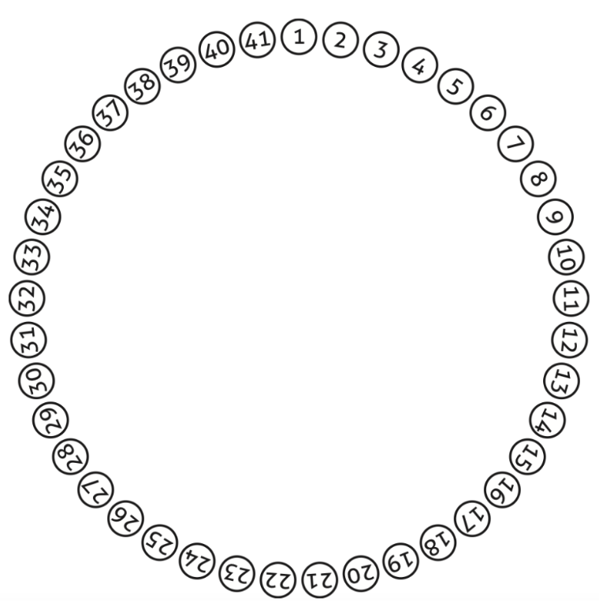

# Practica 6 Introducción a la Inteligencia Artificial: El pro- ceso de razonamiento según la lógica

### Indicaciones

* Dado el siguiente problema hacer el planteamiento matemático y programar el siguiente problema

La historia que sigue es una versión adaptada de lo que supuestamente sucedió durante el siglo I. Sí, el siglo uno. Suena raro, ¿no? Más aún: esa historia dio origen a un problema clásico de la matemática/computación que sobrevivió el paso del tiempo. Se lo conoce con el nombre del “Problema de Josephus”, ya que se supone que fue Flavius Josephus, un historiador judío nacido en Jerusalén, quien describió la situación que vivieron él y 40 soldados que lo acompañaban. En un momento determinado de la guerra judeo-romana, Josephus y su grupo cayeron en una emboscada y quedaron atrapados en una caverna rodeada de soldados enemigos. Después de debatir cómo proceder, optaron por suicidarse antes de ser capturados. Sin embargo, Josephus no estuvo de acuerdo con la propuesta y para que nadie tuviera que quitarse la vida, propuso el siguiente método:“Sentémonos todos en un círculo. Alguno de nosotros empezará primero y matará a quien tenga sentado a la izquierda y así vamos a seguir hasta que –claramente— quedará nada más que uno solo de nosotros con vida. Ese será el único que tendrá que suicidarse”.



Allí están las cuarenta y un posiciones numeradas en forma creciente. Supongamos que empieza el que está sentado en la posición número 1, ese soldado matará al 2. Luego, el 3 matará al 4, el 5 al 6. . . y así siguiendo. Como usted advierte, llegará un momento en el que habrán muerto todos los que están sentados en las posiciones que llevan un número par. Pero cuando muera el último de ellos, el número 40 (a manos del 39), el 41 estará vivo aún y ahora, el que tiene sentado a la izquierda es el número 1 quien había empezado con los asesinatos. De acuerdo con las reglas, el 41 matará al 1, el 3 matará al 5, etc. Creo que ahora está claro que van a morir todos hasta que quede solamente uno con vida.
Es aquí donde aparece una parte interesante de la historia de Josephus. En principio, habrían de morir todos los soldados que estaban con Josephus en la caverna, pero la diferencia es que quien quedara último tendría que suicidarse... Más aún: el sobreviviente tendría que quitarse la vida y no habría ningún otro integrante del grupo que estuviera vivo para verificar que lo hiciera.
Como usted se imagina, Josephus eligió un lugar particular del círculo y se sentó allí. El sabía que siguiendo las reglas escritas más arriba, él habría de quedar como único sobreviviente. Esperó que todos estuvieran muertos, y en lugar de suicidarse, salió de la caverna y se entregó al enemigo.
Pregunta: ¿en qué lugar se sentó Josephus?
El problema es muy conocido en el mundo de la matemática y los pro- gramadores, y es por eso que hay muchísima literatura escrita sobre el tema, pero no hace falta saber nada particular para poder pensarlo. La versión que figura más arriba es solo una de las posibles variantes (la más sencilla) y si yo estuviera junto a usted, le sugeriría que no empiece con el caso de los 41 soldados, sino que intente con números más pequeños (de soldados) de manera tal de ver si le es posible intuir o imaginar una estrategia para determinar al ganador o sobreviviente a medida que va incrementando el número de soldados.
De la misma forma, una vez que hayamos resuelto el problema para 41 soldados, sería interesante pensar en una estrategia que permita deducir cuál será la posición ganadora en el caso general, es decir, independizarse del número 41 y encontrar alguna estrategia o fórmula que permita deducir el número que hay que elegir sin tener que recorrer todos los pasos intermedios.


## Desarrollo

El problema de josephus llega a ser fascinante e intrigante por lo que su solucion tiene aplicaciones interesantes en matematicas y programacion. Para determinar en que lugar se sento josephus, y mas generalmente, encontrar una estrategia para cualquier numero de soldados: aqui esta la solucion.

Supongamos que tenemos un numero $n$ de soldados y queremos encontrar la posicion segura para josephus. La solucion puede ser obtenida utilizando una formula recursiva.

Si $n$ es una potencia de 2 (es decir, $ n=2^m $), entonces Josephus se sienta en la posicion 1. Esto porque como se mencionó, el primer soldado (El que se encuentra en la posicion 1) siempre sobrevive cuando $n$ es una potencia de 2

Si $n$ no es una potencia de 2, podemos escribir $n$ como $ n=2^m+l $, donde l es la cantidad de soldados adicionales despues de la ultima potencia de 2. En este caso , Josephus se sienta en la posicion 2l+1. En terminos generales la formula seria:

 $ f(n)=2 (n-2^(log2(n))+1 $

donde $ log2(n) $ representa la parte entera del logaritmo en base 2 de $ n $

Así que, aplicando esto al caso de 41 soldados, obtenemos:

$ f(41) = 2 (41-2^(log(41))+1) $

Calculando los valores: 

$ log2(41) = 5 $

$ 2^5 =32 $

$ f(41)=2(41-32)+1=2*9+1=19 $

Por lo tanto, Josephus se sentó en la posición 19 para garantizar su supervivencia. Este enfoque se puede generalizar para cualquier número de soldados $ n $

Ahora para programar el ejemplo seria de la siguiente manera:

```
public class Josephus {
    
    public static int encontrarPosicionJosephus(int n) {
        // Verificar si n es una potencia de 2
        if ((n & (n - 1)) == 0) {
            // n es una potencia de 2, Josephus se sienta en la posición 1
            return 1;
        } else {
            // Calcular la posición según la fórmula
            return 2 * (n - Integer.highestOneBit(n)) + 1;
        }
    }

    public static void main(String[] args) {
        int numeroDeSoldados = 41;
        int josephusPosicion = encontrarPosicionJosephus(numeroDeSoldados);
        
        System.out.println("Josephus se sentó en la posición: " + josephusPosicion);
    }
}

```
El metodo encontrarPosicionJosephus

Toma un entero $n$ como parámetro, que representa el número de soldados.

Verifica si $n$ es una potencia de 2 utilizando la expresión (n & (n - 1)) == 0. Si es así, devuelve 1 porque, en este caso, Josephus se sentaría en la posición 1. 

Si $n$ no es una potencia de 2, calcula la posición de Josephus utilizando la fórmula $ 2*(n-2^(log(n))+1)$ y despues devuelve la posicion calculada.

El metodo main 

Define una variable numeroDeSoldados con el valor 41, pero se puedes cambiar este valor según las necesidades.
Llama al método encontrarPosicionJosephus con numeroDeSoldados como argumento y almacena el resultado en josephusPosicion.
Imprime el resultado indicando la posición en la que Josephus se sienta para sobrevivir.