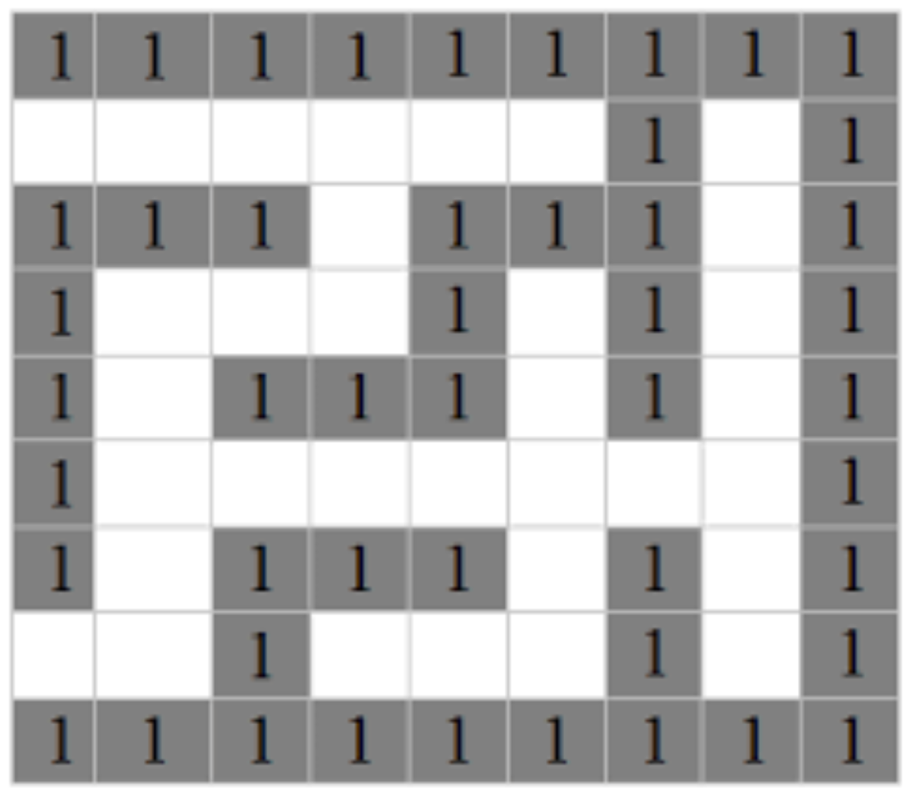
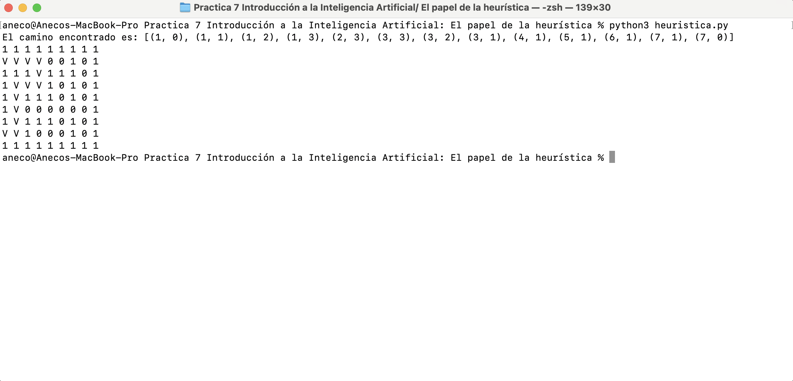

# Practica 7 Introducción a la Inteligencia Artificial: El papel de la heurística

## Indicaciones

Dado el siguiente laberinto



* Definir que es la heuristica y cual es su papel en la resolucion de problemas 

* Resolver la recursividad, programar. 

* Proponer algoritmo de solución, programar.

* Describir el punto anterior.


## Desarrollo

El pensamiento heurístico es un concepto utilizado en distintas disciplinas, pero en el contexto de resolver problemas, se refiere a estrategias o reglas prácticas que permiten abordar situaciones difíciles y llegar a soluciones de forma más efectiva, aunque no forzosamente óptima. La heurística implica utilizar atajos mentales o reglas simplificadas que podrían no garantizar la solución perfecta, pero que resultan útiles para alcanzar una solución aceptable en un tiempo razonable.

El papel del pensamiento heurístico en la resolución de problemas es esencial, especialmente cuando se enfrentan situaciones complejas o cuando la información es limitada. Aquí hay algunos aspectos clave de la heurística en la resolución de problemas:

* Permiten abordar problemas de manera más simple al reducir la complejidad de los mismos.

* Aunque no garantizan la solución óptima, pueden conducir a una solución buena en un tiempo razonable.

* Pueden servir como punto de partida o guía para resolver situaciones nuevas que carecen de una solución conocida.

* Simplificación del problema: Las heurísticas permiten simplificar problemas complejos al reducir la cantidad de información a procesar. Esto facilita la toma de decisiones al centrarse en aspectos clave y evitar la sobrecarga cognitiva.

* Eficiencia en el tiempo: En muchos casos, la búsqueda de la solución perfecta a un problema puede llevar mucho tiempo. Las heurísticas permiten tomar decisiones rápidas basadas en reglas prácticas, lo que es crucial en situaciones donde se necesita actuar de manera inmediata.

* Atajos cognitivos: Las heurísticas utilizan atajos cognitivos que simplifican la toma de decisiones. Estos atajos son reglas generales que se aplican sin necesidad de un análisis exhaustivo de todas las posibles alternativas.

* Adaptabilidad: Las heurísticas son flexibles y pueden adaptarse a diferentes contextos. Pueden ser herramientas valiosas cuando se enfrentan problemas nuevos o no familiares.

* Riesgo de error: Aunque las heurísticas son útiles, también pueden llevar a decisiones subóptimas o errores, ya que no garantizan la solución perfecta. Sin embargo, en muchos casos, el beneficio de la rapidez y la eficiencia supera el riesgo de error.

Ejemplos de heurísticas comunes incluyen la regla del máximo beneficio con el mínimo esfuerzo, la búsqueda de soluciones similares a las que han funcionado en el pasado y la toma de decisiones basada en la información más fácilmente disponible.

Se desarrolla un codigo en python de acuerdo a la imagen mostrada anteriormente donde el laberinto es una matriz bidimensional donde 1 representa una pared y 0 representa un espacio libre.

``` 
laberinto = [
    [1, 1, 1, 1, 1, 1, 1, 1, 1],
    [0, 0, 0, 0, 0, 0, 1, 0, 1],
    [1, 1, 1, 0, 1, 1, 1, 0, 1],
    [1, 0, 0, 0, 1, 0, 1, 0, 1],
    [1, 0, 1, 1, 1, 0, 1, 0, 1],
    [1, 0, 0, 0, 0, 0, 0, 0, 1],
    [1, 0, 1, 1, 1, 0, 1, 0, 1],
    [0, 0, 1, 0, 0, 0, 1, 0, 1],
    [1, 1, 1, 1, 1, 1, 1, 1, 1]
]
```

Luego la función de heurística calcula la distancia Manhattan entre dos puntos, que se utiliza para estimar la distancia al objetivo desde un punto dado. En este caso, la heurística es la distancia total en términos de filas y columnas.

```
def heuristica(start, objetivo):
 return abs(start[0] - objetivo[0]) + abs(star[1] - objetivo[1])

```

Despues define los movimientos posibles: arriba, abajo, izquierda y derecha.

```
movimientos = [(-1, 0), (1, 0), (0, -1), (0, 1)]
```

Luego la función realiza la búsqueda A* de manera recursiva. Utiliza antecesores y g_score para mantener un seguimiento de los nodos visitados y sus costos acumulados.

Definición de punto de inicio y objetivo:

```
punto_inicio = (1, 0)
punto_final = (7, 0)
antecesores = {punto_inicio: None}
g_score = {punto_inicio: 0}
visitados = set([punto_inicio])

```

Llamada a la función de búsqueda A:*

```
resultado, visitados = a_estrella_recursiva(laberinto, punto_inicio, punto_final, antecesores, g_score, visitados)

```

Impresión del resultado:

```
if resultado:
    # ...
else:
    print("No se encontró un camino válido.")

```
Si se encuentra un camino, imprime el camino y muestra las celdas visitadas en el laberinto.



Primero, el camino encontrado es una lista de coordenadas que representan las posiciones desde el punto de inicio hasta el punto final en el laberinto. En este caso, el camino encontrado es:

```
[(1, 0), (1, 1), (1, 2), (1, 3), (2, 3), (3, 3), (3, 2), (3, 1), (4, 1), (5, 1), (6, 1), (7, 1), (7, 0)]
```
Esto significa que el camino comienza en la posición (1, 0), se mueve hacia la derecha, sube, y sigue siguiendo un camino que atraviesa el laberinto hasta llegar a la posición final (7, 0).

El laberinto impreso muestra las celdas visitadas marcadas con 'V'. Aquí está el laberinto después de la búsqueda:

```
1 1 1 1 1 1 1 1 1 
V V V V 0 0 1 0 1 
1 1 1 V 1 1 1 0 1 
1 V V V 1 0 1 0 1 
1 V 1 1 1 0 1 0 1 
1 V 0 0 0 0 0 0 1 
1 V 1 1 1 0 1 0 1 
V V 1 0 0 0 1 0 1 
1 1 1 1 1 1 1 1 1 
```

El punto de inicio es (1, 0), marcado como 'V'. Desde (1, 0), se mueve hacia la derecha hasta (1, 3), marcando las celdas visitadas. Luego, sube hasta (2, 3). Continúa siguiendo el camino, llega a (3, 3), baja a (3, 2), (3, 1), y así sucesivamente. Finalmente, llega al punto final en (7, 0), marcándolo también como 'V'.

Este camino representa la ruta más corta desde el punto de inicio hasta el punto final en el laberinto dado, evitando las paredes (celdas con valor 1). Cada paso en el camino se marca como 'V' para indicar que ha sido visitado.