# Practica 8 Reglas y Búsquedas : Espacio de Estados

## Indicaciones

1. Generar un espacio de estados de los siguiente problemas 

El juego consiste en pasar las 3 ranas verdes a la derecha y las 3 ranas marrones a la izquierda. Las ranas pueden saltar a una piedra vacía que tengan delante, o saltar por encima de otra rana si en medio de ambas hay una piedra vacía. Pulsa sobre la rana que quieres que salte.

Consideremos una cosa, nuestro primer estado inicial sera definir nuestras variables. Como primer punto sera definir las ranas verdes con la letra "V", las ranas marrones con la letra "M" y una piedra vacia con un punto "."

 
| V | V | V | . | M | M | M | 
|---|---|---|---|---|---|---|
| - | - | - | - | - | - | - | 

Para hacer mas entendible la grafica, abajo de cada rana y cada piedra se asignara un numero

| V | V | V | . | M | M | M | 
|---|---|---|---|---|---|---|
| 1 | 2 | 3 | 4 | 5 | 6 | 7 | 

Si bien recordamos las ranas solo pueden a una piedra vacia que tengan adelante o saltar por encima de otra ranas si en medio de ambas hay una piedra vacia.
Entonces como primer punto haremos que la rana verde que se encuentra en la posicion 3 salte a la piedra vacia que tiene en frente. Quedando el lugar 3 desocupado y ocupandose el lugar 4

| V | V | . | V | M | M | M | 
|---|---|---|---|---|---|---|
| 1 | 2 | 3 | 4 | 5 | 6 | 7 | 

Ahora la rana marron pasa a la posicion 3 dejando la posicion 5 libre

| V | V | M | V | . | M | M | 
|---|---|---|---|---|---|---|
| 1 | 2 | 3 | 4 | 5 | 6 | 7 | 

La rana que estaba en la posicion 6 pasa a la posicion 5

| V | V | M | V | M | . | M | 
|---|---|---|---|---|---|---|
| 1 | 2 | 3 | 4 | 5 | 6 | 7 | 

La rana que estaba en la posicion 4 pasa a la posicion 6

| V | V | M | . | M | V | M | 
|---|---|---|---|---|---|---|
| 1 | 2 | 3 | 4 | 5 | 6 | 7 | 

La rana que estaba en la posicion 2 pasa a la posicion 4

| V | . | M | V | M | V | M | 
|---|---|---|---|---|---|---|
| 1 | 2 | 3 | 4 | 5 | 6 | 7 | 

La rana que estaba en la posicion 1 pasa a la posicion 2

| . | V | M | V | M | V | M | 
|---|---|---|---|---|---|---|
| 1 | 2 | 3 | 4 | 5 | 6 | 7 | 

La rana que estaba en la posicion 3 pasa a la posicion 1

| M | V | . | V | M | V | M | 
|---|---|---|---|---|---|---|
| 1 | 2 | 3 | 4 | 5 | 6 | 7 | 

La rana que estaba en la posicion 5 pasa a la posicion 3

| M | V | M | V | . | V | M | 
|---|---|---|---|---|---|---|
| 1 | 2 | 3 | 4 | 5 | 6 | 7 | 

La rana que estaba en la posicion 7 pasa a la posicion 5

| M | V | M | V | M | V | . | 
|---|---|---|---|---|---|---|
| 1 | 2 | 3 | 4 | 5 | 6 | 7 | 

La rana que estaba en la posicion 6 pasa a la posicion 7

| M | V | M | V | M | . | V | 
|---|---|---|---|---|---|---|
| 1 | 2 | 3 | 4 | 5 | 6 | 7 | 

La rana que estaba en la posicion 4 pasa a la posicion 6

| M | V | M | . | M | V | V | 
|---|---|---|---|---|---|---|
| 1 | 2 | 3 | 4 | 5 | 6 | 7 | 

La rana que estaba en la posicion 2 pasa a la posicion 4

| M | . | M | V | M | V | V | 
|---|---|---|---|---|---|---|
| 1 | 2 | 3 | 4 | 5 | 6 | 7 | 

La rana que estaba en la posicion 3 pasa a la posicion 2

| M | M | . | V | M | V | V | 
|---|---|---|---|---|---|---|
| 1 | 2 | 3 | 4 | 5 | 6 | 7 | 

La rana que estaba en la posicion 5 pasa a la posicion 3

| M | M | M | V | . | V | V | 
|---|---|---|---|---|---|---|
| 1 | 2 | 3 | 4 | 5 | 6 | 7 | 

La rana que estaba en la posicion 4 pasa a la posicion 5

| M | M | M | . | V | V | V | 
|---|---|---|---|---|---|---|
| 1 | 2 | 3 | 4 | 5 | 6 | 7 | 

Tres misioneros se perdieron explorando una jungla. Separados de sus compañeros, sin alimento y sin radio, solo sabían que para llegar a su destino debían ir siempre hacia adelante. Los tres misioneros se detuvieron frente a un río que les bloqueaba el paso, preguntándose que podían hacer. De repente, aparecieron tres caníbales llevando un bote, pues también el los querían cruzar el río. Ya anteriormente se habían encontrado grupos de misioneros y caníbales, y cada uno respetaba a los otros, pero sin confiar en ellos. Los caníbales se daban un festín con los misioneros cuando les superaban en número.
Los tres caníbales deseaban ayudar a los misioneros a cruzar el río, pero su bote no podía llevar más de dos personas a la vez y los misioneros no querían que los caníbales les superaran en número.
¿Cómo puede resolverse el problema, sin que en ningún momento haya más caníbales que misioneros en cualquier orilla del río? recuerda que un misionero y un caníbal en una orilla del río más uno o dos caníbales en el bote al mismo lado, significa que los misioneros tendrán problemas.

Como podemos analizar tenemos que pasar tanto monjes como canibales al otro lado

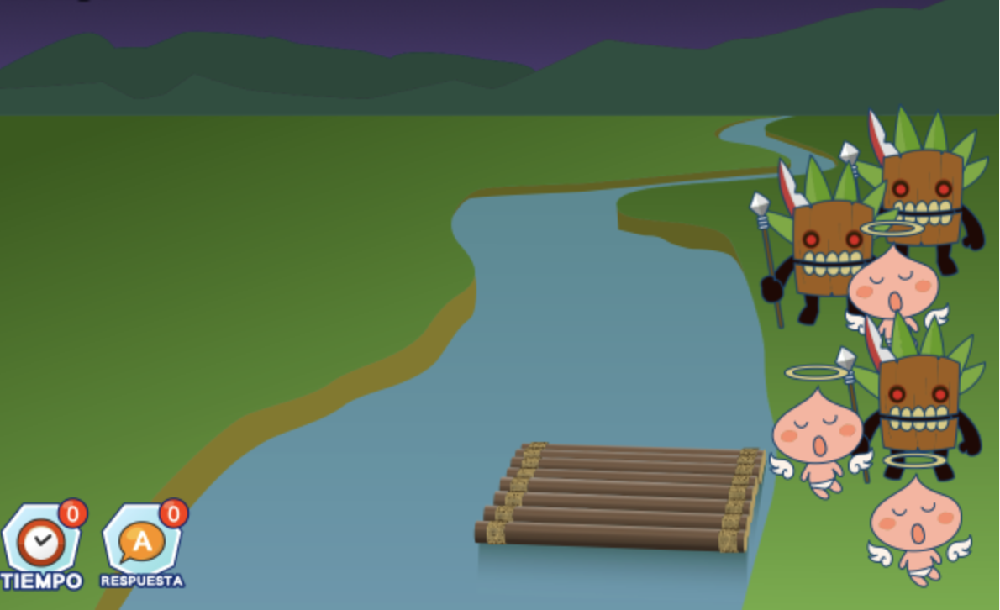

Como primer paso ponemos un monje y un canibal en la lancha y los llevamos al otro lado

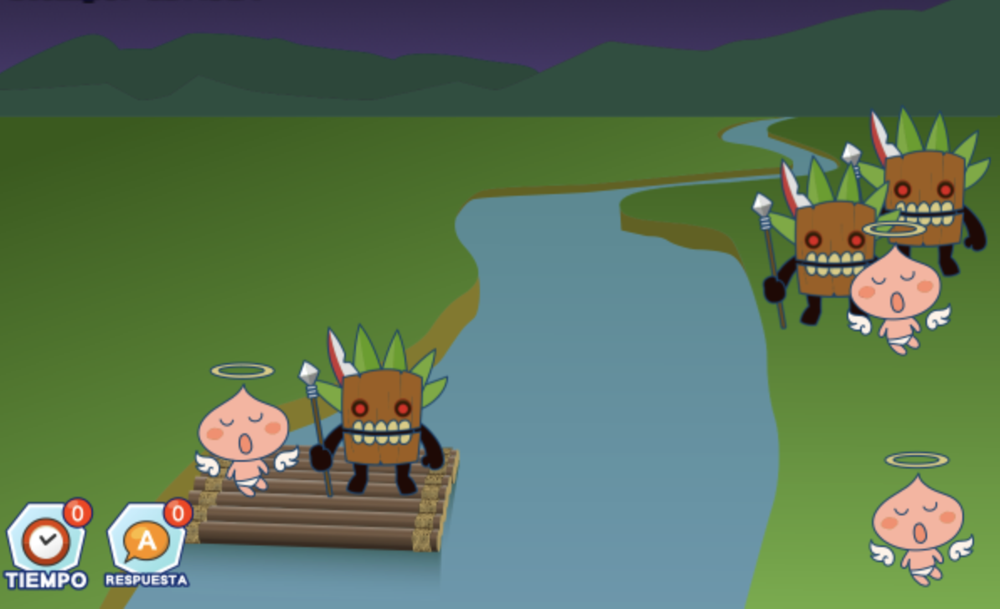

Como segundo paso dejamos al canibal y regresamos al monje

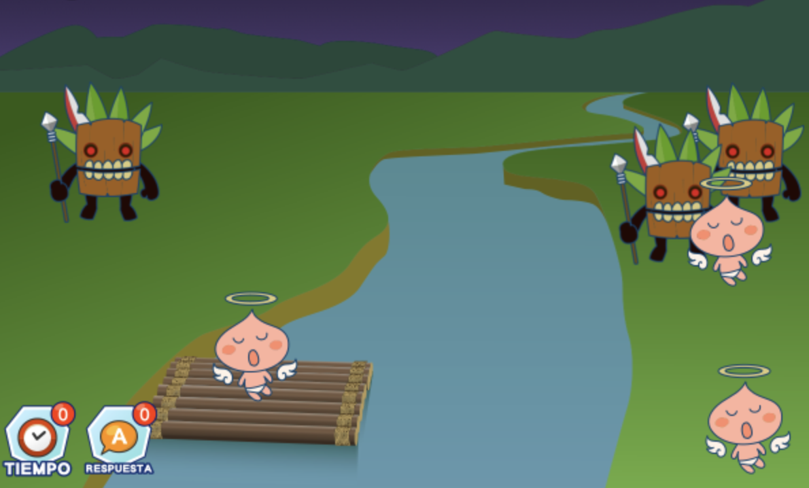

Como tercero paso subimos a 2 monjes

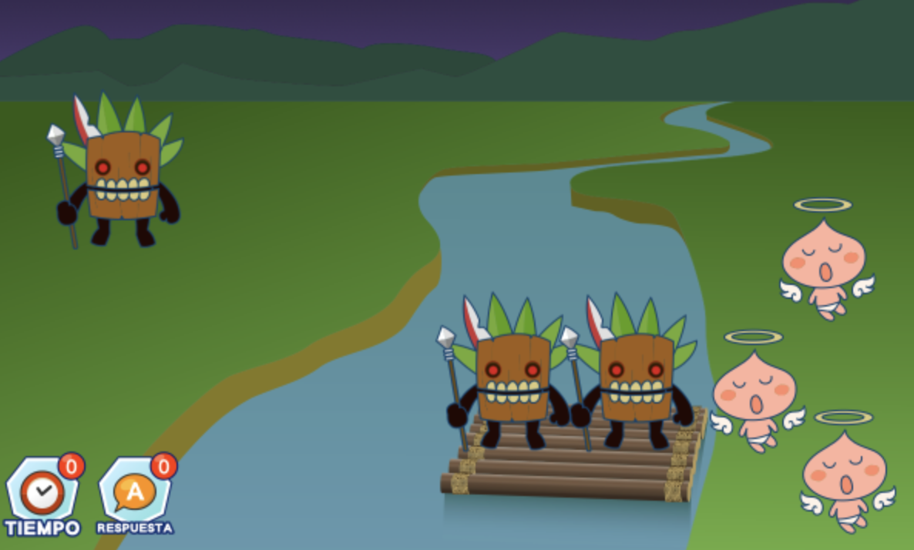

Como cuarto paso dejamos a un canibal al otro lado

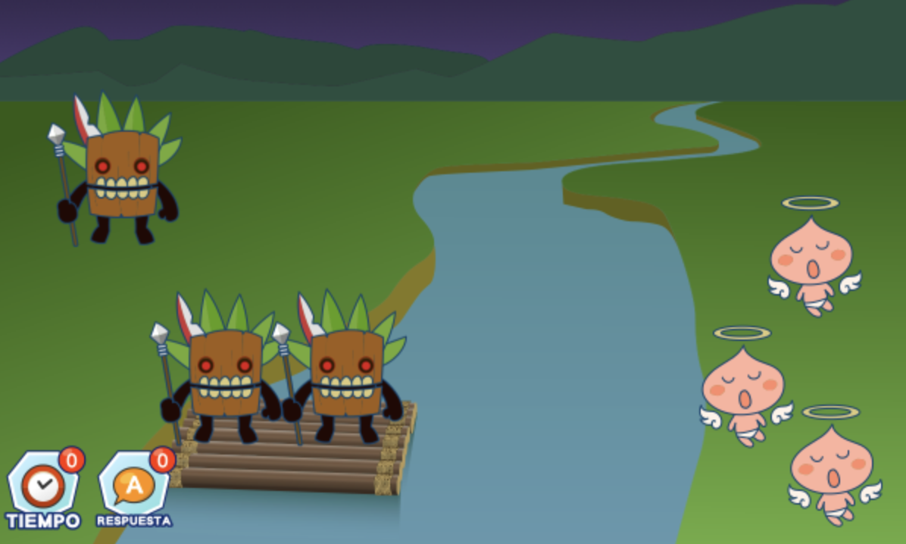

Como quinto paso regresamos a un canibal

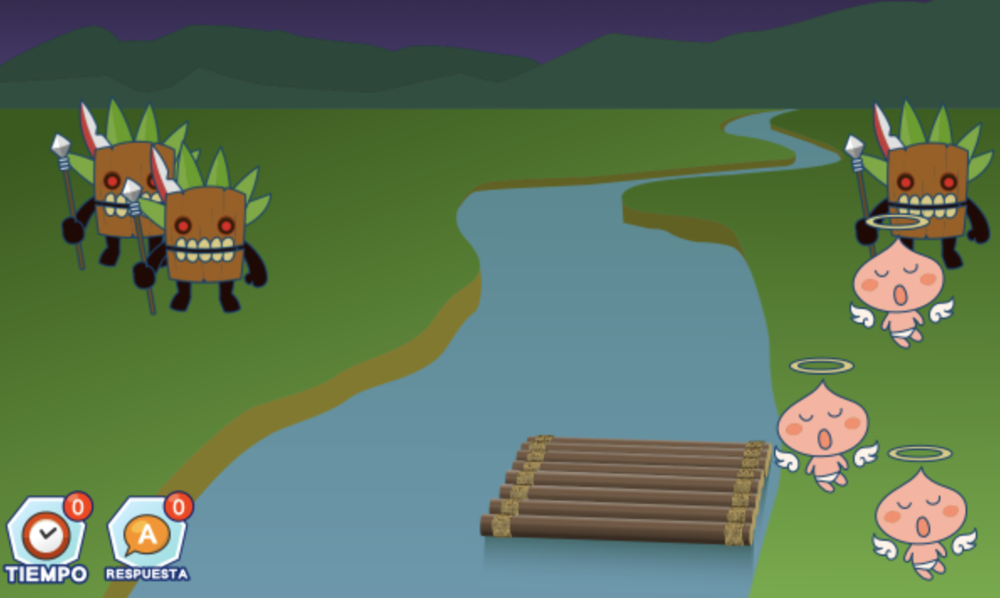

Como sexto paso cargamos a 2 monjes al otro lado

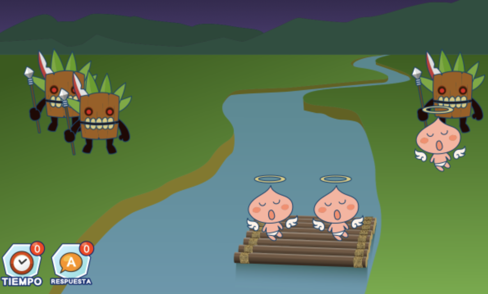

Como septimo paso dejamos a un monje al otro lado y cargamos a un canibal y un monje al extremo derecho

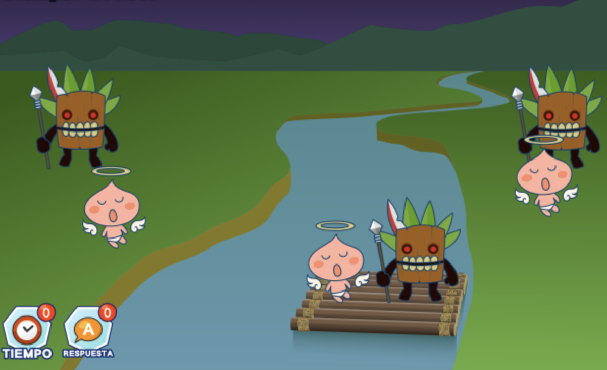

Como octavo paso dejamos a un canibal y cargamos a un monje a la lancha

Como noveno paso dejamos 3 monjes en la esquina izquierda y nos regresamos con un canibal en la lancha

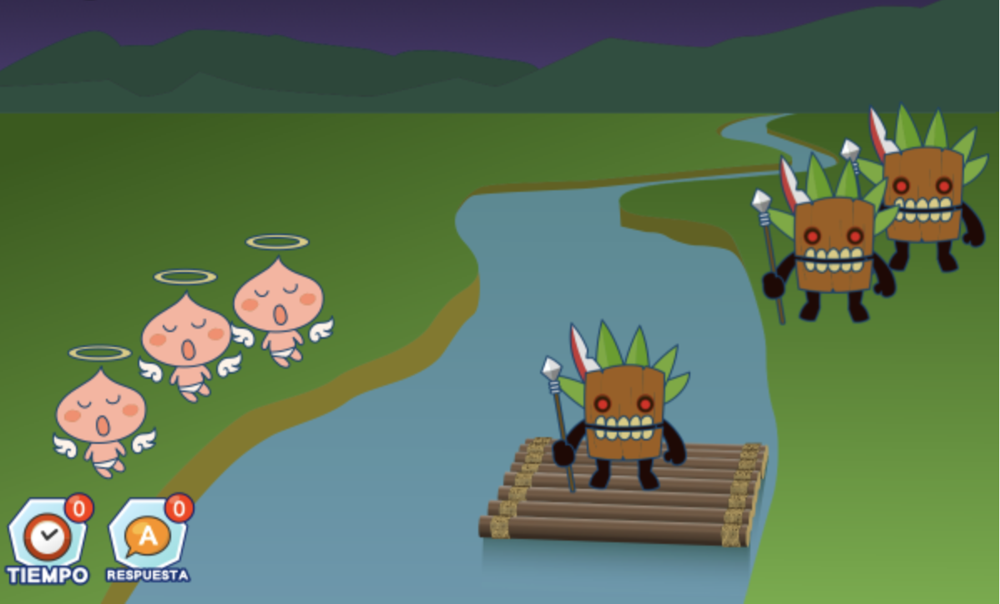

Como decimo paso cargamos a 2 canibales en la lancha y llevamos al otro extremo

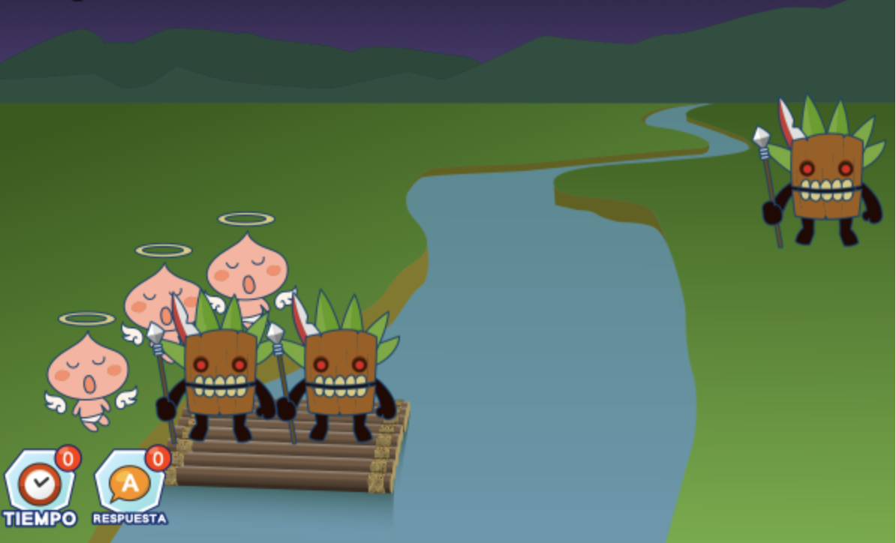

Como onceavo paso dejamos a un solo canibal y regresamos al otro 

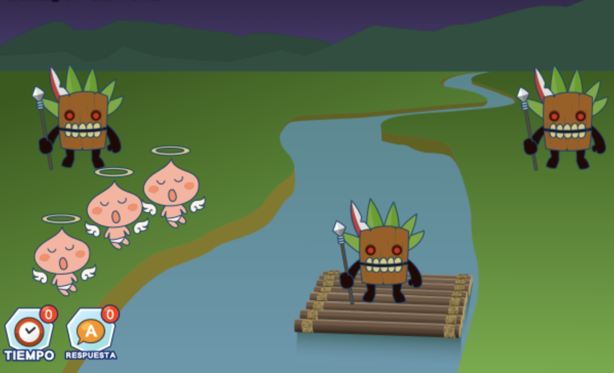

Como doceavo paso cargamos a los 2 monjes al otro extremos y vemos que ya todos pueden estar en el otro lado de la isla

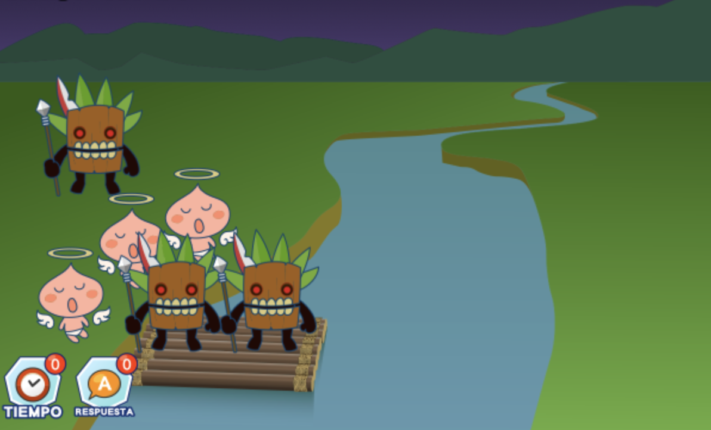